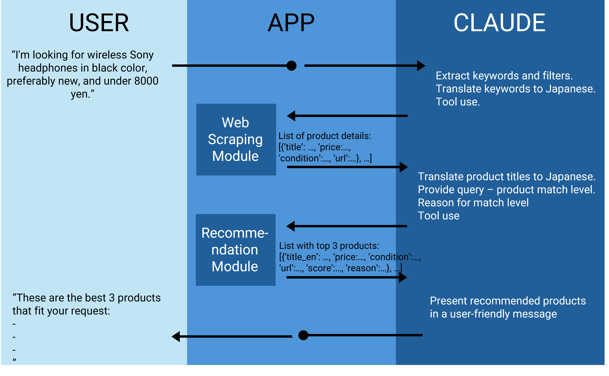

# Mercari AI Recommendation Agent

<p align="center">
  
</p>

## Table of Contents

* [Overview](#overview)
* [Setup Instructions](#setup-instructions)
* [Usage Instructions](#usage-instructions)
* [Agent Workflow](#agent-workflow)
* [Design Choices](#design-choices)
* [Potential Improvements](#potential-improvements)

## Overview

This project is a modular AI-powered recommendation system designed to process natural language shopping requests, extract structured search queries, scrape product data from Mercari Japan, and return the top 3 product recommendations with reasons.

It integrates several components:

* **Python version**: 3.13.2
* **LLM API**: Anthropic Claude 3.5 (latest)
* **Web Scraping Tools**: Selenium, BeautifulSoup4
* **Semantic Matching**: SentenceTransformer model (all-MiniLM-L6-v2)

## Setup Instructions

> You can optionally use a dedicated conda environment:

```bash
conda create --name mercari-agent python=3.13.2
conda activate mercari-agent
```

Install project dependencies:

```bash
pip install -r requirements.txt
```

Add your Claude API key to a `.env` file in the project root:

```env
ANTHROPIC_API_KEY=your_api_key_here
```

## Usage Instructions

Run the agent with your query following --request:

```bash
python main.py --request "I'm looking for wireless Sony headphones in black color, preferably new, and under 8000 yen."
```

## Agent Workflow

This project follows a modular design with separate components for each task. Each stage references a dedicated README for internal documentation:

1. **Keyword Extraction**
   Claude tool processes the user’s request to produce English and Japanese keywords, as well as filters like brand, category, and condition.

2. **Web Scraping**
   Using Selenium and BeautifulSoup, product URLs and detailed attributes are scraped from Mercari Japan using the Japanese keywords. 

3. **Translation**
   Product titles (in Japanese) are translated to English using Claude, to support semantic matching with the original English query.

4. **Recommendation and Selection**
   A final score is computed based on similarity, match quality, condition, and price. The top 3 products are selected.

5. **Final Response Generation**
   The top results, scores, and Claude-generated reasoning are formatted into a natural language recommendation message.

## Design Choices

### LLM Usage (Claude Tooling)

* Two structured tools are defined in `tools.py`:

  * `extract_keywords_filters_tool`: Extracts English and Japanese keywords, and structured filters (brand, price range, condition, category) from a user’s natural language query.
  * `recommendation_tool`: Accepts product titles, Claude's match levels (e.g., "Excellent match"), and reasons to guide semantic ranking.
* Using Japanese keywords improves Mercari search accuracy due to better alignment with product listings.
* Claude translates product titles from Japanese to English to enable semantic similarity comparisons with the original English user query.
* Claude also generates match levels and reasons, used in the scoring phase.
* Finally, Claude formats the top-3 product list into a fluent, user-friendly message.

### Web Scraping

* Implemented using Selenium with realistic browser headers and anti-bot evasion.
* Since Mercari loads results dynamically, `window.scrollTo()` is used to simulate user interaction and force DOM expansion.
* Product listings are located using CSS selectors like `li[data-testid='item-cell']`, and the script waits for them to load before scrolling again.
* Once all listings are gathered, individual product detail pages are opened and parsed using BeautifulSoup.
* Critical metadata (price, title, condition) is extracted based on consistent structural anchors in the HTML.
* The search query used in Mercari URLs is constructed using Claude-provided Japanese keywords for optimal coverage.

→ Full documentation in [web\_scrapping/README.md](./web_scrapping/README.md)

### Recommendation

The recommendation logic is built on a hybrid of NLP techniques and heuristic scoring.
* NLP-based semantic similarity is computed using the `all-MiniLM-L6-v2` SentenceTransformer model with cosine similarity. This aligns the user query with each product’s English-translated title. While we use Claude to provide `match_levels` indicating relevance (e.g., "Excellent match", "Good match"). These match levels are later mapped to fixed numerial values.

* Price and condition are scored heuristically:

  * Price is normalized using min-max scaling and inverted to prioritize lower prices.
  * Condition is mapped to fixed scores (e.g., "新品、未使用" = 1.0, "全体的に状態が悪い" = 0.1).
* A weighted aggregation is used to compute the final recommendation score and rank the best 3 products:

  ```python
  final_score = 0.2 * semantic_similarity + 0.4 * match_score + 0.3 * price_score + 0.1 * condition_score
  ```

→ Full documentation in [recommendation/README.md](./recommendation/README.md)

## Potential Improvements

1. **Interactive Agent Loop**
   Currently, the agent processes a single-shot request and returns a result. However, a more interactive approach would enhance recommendation quality. For example, if no strong matches are found, the agent could ask follow-up questions (e.g., “Is a different brand acceptable?” or “Would you prefer used items under a certain price?”). This would enable better disambiguation and more user-aligned responses.

2. **Enhanced Search Filtering**
   At present, Claude extracts filters like brand, size, and category as text and these are translated into Japanese keywords used for URL-based search. While effective, it lacks precision. Mercari’s actual filtering system uses encoded parameters (e.g., `brand_id`, `size_id`, or category-specific tags) that are not exposed through the UI but used in network requests. Reverse-engineering or scraping these filter mappings would allow more accurate targeting of search queries, especially for clothes, shoes, and electronics.

3. **Advanced Recommendation Modeling**
   The current scoring pipeline is based on heuristics with fixed weights for match level, similarity, condition, and price. While interpretable, this is limited in adaptability. A potential upgrade would be to use a regression model or neural network trained to predict a recommendation score based on a product's features and historical user behavior. This would allow:

   * Better personalization (e.g., learning user preferences over time)
   * Tuning scoring dynamically per user or category

